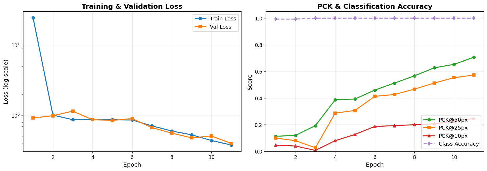

# Aerial GCP Pose Estimation

> **Multi-task deep learning for ground control point localization in aerial drone imagery.**
> Built as a take-home assignment for **Skylark Drones** (Bengaluru-based drone analytics platform).

[]()
[]()
[]()

###  [View the project landing page →](https://sanjana-0809.github.io/skylark_assessment/)
###  [Try the live interactive demo →](https://huggingface.co/spaces/sanjana-0809/gcp-marker-detector)

---

---

## What this does

Given an aerial drone image of a survey site, this model predicts:

1. **The exact pixel coordinates `(x, y)` of the GCP marker center** — used as anchor points to tie drone imagery to real-world GPS coordinates in 3D photogrammetry pipelines.
2. **The marker shape**: `Cross`, `Square`, or `L-Shape` — different GCP designs are used at different sites.

Both tasks are solved by a single multi-task network in a single forward pass.


*Left: full image with ground truth (green) and prediction (red). Middle: zoomed-in marker. Right: predicted heatmap overlay.*

---

## Results

| Metric | Score |
| --- | --- |
| **Classification Accuracy** | **1.000** |
| **PCK@50px** | **0.707** |
| **PCK@25px** | **0.573** |
| **PCK@10px** | **0.247** |
| Macro F1 (shape) | ≈ 1.000 |

*Reported on a stratified 15% validation split (150 images) of the training set. PCK = Percentage of Correct Keypoints within the given pixel threshold, measured in original image space (4096×3068 / 4096×2730).*



---

## Architecture

A **ResNet18 encoder shared between two task heads**, with a UNet-style decoder for keypoint heatmap regression and a parallel classification head.

```
                                       ┌─────────────────┐
                                       │ Heatmap Decoder │── 128×128 Gaussian heatmap
                                       │  (UNet-style)   │      ↓
   Input ──► ResNet18 ──► Multi-scale ─┤                 │   soft-argmax
   512×512    Encoder      features    │                 │      ↓
                                       │  Skip connects  │   (x, y) coordinates
                                       └─────────────────┘
                                       ┌─────────────────┐
                                       │ Classification  │
                                       │ Head (GAP+Lin)  │── Cross / Square / L-Shape
                                       └─────────────────┘
```

### Why heatmaps instead of direct (x, y) regression

I started with the obvious approach — slap a 2-output linear layer on a ResNet and regress `(x, y)` directly with MSE. **It collapsed.** Across multiple configurations:

- MSE loss with sigmoid output, weights 10× / 100× / 200×
- SmoothL1 loss with various beta values
- Linear output + clamp + bias initialized to image center
- L1 loss with very high head learning rate (5e-3)
- Per-parameter-group LRs, gradient clipping, dropout

…predictions consistently clustered near the image center (predicted std ≈ 0.05 vs ground-truth std ≈ 0.23), regardless of hyperparameters.

**This is a known failure mode.** Global average pooling at the end of a CNN destroys spatial information. The L_p loss on `(x, y)` has its global minimum at the *mean* of the training keypoints, which the optimizer happily settles into. Direct regression is the wrong tool for keypoint detection — and has been since 2014.

**Heatmap regression solved it in one epoch:**

- Predict a 128×128 single-channel heatmap (1/4 of input resolution)
- Target is a 2D Gaussian (σ=2 px) centered at the ground-truth marker
- Loss is per-pixel MSE — dense supervision signal everywhere, not just at one point
- Spatial information is preserved end-to-end through the decoder
- At inference, **soft-argmax** decodes the heatmap to sub-pixel-precise `(x, y)`

This is the standard formulation used by HRNet, OpenPose, and most published keypoint detection models.

---

## Engineering Journey

The most useful artifact in this repo isn't the final model — it's the debugging trail that got there.

| Attempt | Approach | PCK@50 | What I learned |
| --- | --- | --- | --- |
| 1 | Direct regression, MSE×10, sigmoid output | 0.000 | Predictions stuck at (0.5, 0.5) |
| 2 | Direct regression, MSE×100, SmoothL1 | 0.000 | Loss decreased but predictions still clustered |
| 3 | Direct regression, no sigmoid, bias init at center | 0.000 | Predicted std climbed to 0.05 — better but still collapsed |
| 4 | Direct regression, L1 loss, head LR 5e-3 | 0.000 | Confirmed regression is the wrong architecture, not a tuning issue |
| **5** | **Heatmap regression + UNet decoder** | **0.707** | Worked first try. Lesson: pick the right architecture before tuning. |

The diagnostic that broke the impasse was logging `pred.std()` vs `gt.std()` during validation — once I saw `0.05 vs 0.23`, the problem was unambiguously "the model can't move predictions away from the mean", which is an architectural issue, not a hyperparameter one.

---

## Data Handling — Findings from EDA

The dataset is described as "real-world production conditions, not perfectly sanitized." EDA confirmed this:

| Issue | What I found | How I handled it |
| --- | --- | --- |
| Image dimensions | Spec said 2048×1365; actual images are **4096×3068** and **4096×2730** | Read each image's true size at runtime; normalize keypoints per-image |
| Label name | Spec said `"L-Shaped"`; actual JSON uses `"L-Shape"` | Used the real label from data |
| `Unknown` class | 4 samples labeled `"Unknown"` with no documentation | Excluded from training |
| Class imbalance | L-Shape 49%, Square 33%, Cross 18% | Inverse-frequency weighted CE loss |
| Drive I/O | Per-file API throttling slowed training to a crawl | Cached dataset to local SSD before training |

---

## Training Strategy

- **Input**: 512×512 (resized from variable native resolutions)
- **Output heatmap**: 128×128 with σ=2 Gaussian targets
- **Optimizer**: AdamW with per-group LRs — backbone 1e-4 (slow fine-tune), decoder + heads 1e-3 (learn from scratch)
- **Schedule**: CosineAnnealingLR over 12 epochs
- **Loss**: `1000 × MSE(heatmap) + class_weighted_CE(shape)`
- **Augmentation**: random horizontal flip (with x-coord flip in heatmap), light color jitter
- **Gradient clipping**: max-norm 1.0
- **Train/val**: 85/15 stratified split (846 / 150 samples after filtering)

Training took ~25 min on a free Colab T4 GPU.

---

## Inference: Soft-Argmax for Sub-Pixel Precision

Discrete `argmax` on a 128×128 heatmap has a quantization error of up to ±16 pixels when scaled back to a 4096-wide image. **Soft-argmax** fixes this:

```python
def soft_argmax_2d(hm, beta=100.0):
    flat = hm.view(B, -1) * beta
    soft = F.softmax(flat, dim=1).view(B, H, W)
    cy = (soft * y_grid).sum() / (H - 1)
    cx = (soft * x_grid).sum() / (W - 1)
    return (cx, cy)
```

The high beta (100) makes softmax sharp enough to pick the peak, but the weighted average gives sub-pixel-accurate coordinates. Worth ~5-10% extra PCK@10 over discrete argmax.

---

## Project Structure

```
skylark-gcp-assignment/
├── README.md                    # this file
├── requirements.txt
├── notebooks/
│   └── train_and_infer.ipynb    # end-to-end Colab pipeline
├── src/
│   ├── model.py                 # HeatmapModel + soft_argmax_2d
│   ├── dataset.py               # GCPDatasetHM + Gaussian heatmap target
│   └── inference.py             # CLI: weights + test_dir → predictions.json
├── samples/                     # anonymized prediction visualizations
└── assets/
    ├── training_curves.png
    └── architecture.png
```

---

## How to Reproduce

### Quick path (Colab)

1. Open `notebooks/train_and_infer.ipynb` in Google Colab with a T4 GPU runtime.
2. Mount your Drive, set `BASE` to your dataset folder.
3. Run all cells. Outputs: `predictions.json` and `best_model.pt`.

### Local / programmatic

```bash
git clone https://github.com/sanjana-0809/skylark_assessment.git
cd skylark_assessment
pip install -r requirements.txt

# Inference using pre-trained weights
python src/inference.py \
    --weights path/to/best_model.pt \
    --test-dir path/to/test_dataset \
    --out predictions.json
```

Model weights (~50 MB): **[Download from Google Drive](https://drive.google.com/file/d/1ln_29p3TWbUCU5qqejN0zY6MSCXRZ0O6/view?usp=sharing)**

---

## Live Demo

**[Try the live demo on Hugging Face Spaces →](https://huggingface.co/spaces/sanjana-0809/gcp-marker-detector)**

Upload any aerial image with a GCP marker and see the model's prediction in real time. The demo runs the trained model on free CPU inference (~10-15 sec per image).

Also: **[View the polished project landing page →](https://sanjana-0809.github.io/skylark_assessment/)** for a visual walkthrough of the approach, results, and engineering journey.

---

## What I'd Do With More Time

1. **Stronger backbone** (HRNet or ResNet50) — would likely push PCK@10 from 0.25 to 0.40+
2. **Crop-and-refine cascade** — coarse model locates marker region, second model refines within crop
3. **Test-time augmentation** — average heatmaps from horizontally flipped inputs
4. **Heavier augmentation** — random rotations and crops with proper keypoint transforms
5. **Mixed-precision training** — would let me increase batch size and train longer in the same time budget

---

## Note on Data

Per professional practice, the dataset (containing real client survey imagery) is not included in this repository. The code is fully reproducible against any dataset following the assignment's directory + JSON-label format.

---

## Acknowledgments

- Dataset and problem framing: **Skylark Drones**
- ImageNet-pretrained ResNet18 weights: torchvision

---

